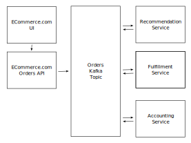

# Table of Contents <!-- omit in toc -->

- [Intro](#intro)
- [What is Kafka](#what-is-kafka)
- [Demo](#demo)
- [When to use Kafka](#when-to-use-kafka)
  - [High Throughput](#high-throughput)
  - [Events which are processed by multiple consumers](#events-which-are-processed-by-multiple-consumers)
  - [Decoupled systems](#decoupled-systems)
- [When not to use Kafka](#when-not-to-use-kafka)
- [Outro](#outro)
- [Resources](#resources)

# Intro

What's up YouTube, Jay here. In this video I'm going to give you tell you a little bit about Kafka. I'll talk about what Kafka is, how to use it, and some time you may want to use or avoid kafka.

# What is Kafka

Kafka is a distributed, append only, event log that can be used for streaming realtime event data.

Now that's a log of buzzwords, lets break that down.

Kafka is distributed, it runs on multiple brokers connected in a cluster with data replicated across brokers for redundancy in case a broker goes down.

Kafka is append only, this makes it super fast to write to (and read from in chronological order). The data in kafka is immutable but does support compaction.

Kafka tracks events. For example, think about transactions at a bank as opposed to the account balance. A transaction is an event that happens at a given point in time. After the transaction occurs it will not change. The account balance is something that changes over time. The account balance can be calculated based on the events that have occurred, but they are different things.

Kafka allows processing realtime data via a publish/subscribe architecture using decoupled publishers and consumers. You can have multiple producers producing data to a topic (which we'll talk more about later), and you can have multiple consumers polling and consuming data from the topic simultaneously.

# Demo

# When to use Kafka

## High Throughput
Use Kafka if you need very high throughput. Kafka out-performs RabbitMQ on throughput: https://www.confluent.io/blog/kafka-fastest-messaging-system/#throughput-results, Kafka is good at horizontal scaling, whereas RabbitMQ doesn't have great horizontal scaling performance. RabbitMQ performs best with an empty queue because all the messages can be stored in memory, if the queue overflows to disk it RabbitMQ slows down greatly.

## Events which are processed by multiple consumers
If you need multiple consumers to process an event Kafka is a good option. Consumers can be split up into consumer groups which each have their own index per partition. This means that multiple consumer groups can read the same event. As opposed to a queue which deletes the message once it is read.

For example, if you have an e-commerce site, when you have a customer order there may be multiple systems that need to process that event.

The event could be read by:
- an accounting service to track sales
- a fulfillment service which goes to the warehouse to fulfill the order
- a recommendation service which provides recommendations to a customer based on their order history

## Decoupled systems

This is mostly true to queues in general.

Kafka can be used as an interface between systems. Publishers can publish to a queue without knowing anything about the downstream systems. 

# When not to use Kafka

If you really need the lower latency of RabbitMQ at lower throughput, think

# Outro

# Resources

- Should you run Kafka on Kubernetes? : https://www.confluent.io/blog/apache-kafka-kubernetes-could-you-should-you/
- Kafka long polling: https://kafka.apache.org/documentation.html#design_pull

